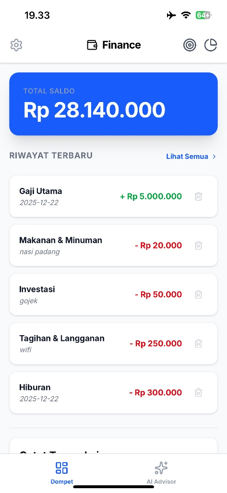
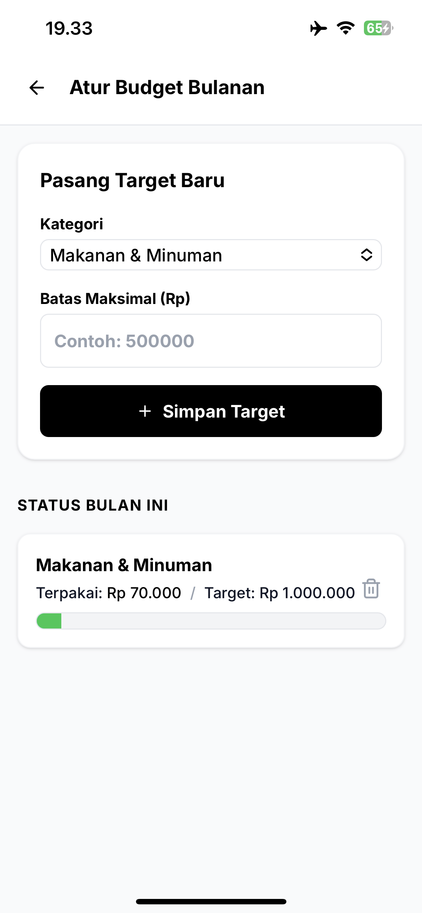
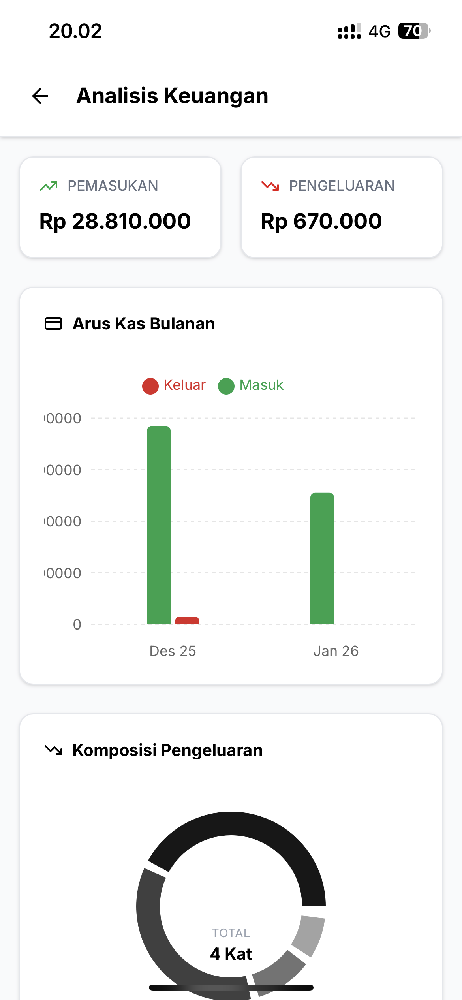
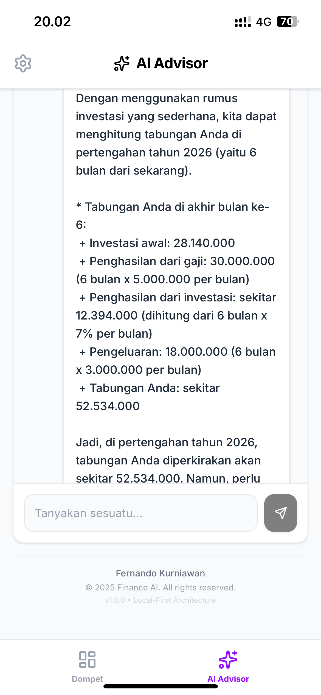
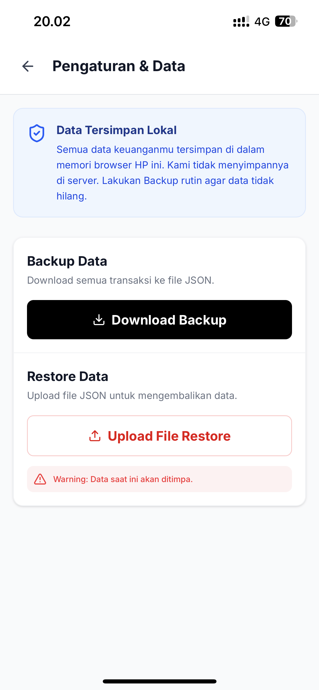

# Finance AI - Personal Finance Tracker PWA

Aplikasi pencatat keuangan berbasis **Local-First PWA** yang terintegrasi dengan Artificial Intelligence untuk memberikan saran finansial cerdas berdasarkan data transaksi pengguna.

## 📱 Fitur Unggulan

Berikut adalah antarmuka utama aplikasi:

### 1. Dashboard & Pelacakan Transaksi

  

**Real-time Dashboard:** Menampilkan total saldo terkini dan riwayat transaksi (pemasukan/pengeluaran) secara *real-time*. Desain bersih memudahkan pemantauan arus kas harian.

---

### 2. Manajemen Budget Cerdas

  

**Smart Budgeting:** Pengguna dapat menetapkan batas maksimal pengeluaran per kategori (misal: Makanan & Minuman) untuk menjaga kesehatan finansial bulanan. Dilengkapi visualisasi *progress bar* pemakaian budget.

---

### 3. Visualisasi & Analisis Data

  

**Deep Analytics:** Visualisasi data menggunakan grafik batang (*Bar Chart*) untuk arus kas bulanan dan diagram lingkaran (*Pie Chart*) untuk komposisi pengeluaran. Membantu pengguna memahami pola konsumsi mereka secara visual.

---

### 4. AI Financial Advisor

  

**Personalized AI Consultant:** Fitur chat interaktif dengan AI yang menganalisis data keuangan pengguna untuk memberikan saran, hitungan investasi, atau strategi penghematan yang personal dan kontekstual.

---

### 5. Privasi & Keamanan Data (Local-First)

  

**Local-First Architecture:** Privasi adalah prioritas. Data tersimpan 100% di browser pengguna (IndexedDB/Dexie.js) tanpa server database terpusat. Dilengkapi fitur **Backup & Restore** (JSON) untuk keamanan data lintas perangkat.

---

## 🛠️ Tech Stack Highlights

* **Framework:** Next.js 16 (App Router)
* **Database:** Dexie.js (IndexedDB Wrapper).
* **AI Integration:** Llama 3.
* **Styling:** Tailwind CSS & Framer Motion.
* **Architecture:** PWA (Progressive Web App) & Offline-first.

  
  
<em>Implementasi sinkronisasi history chat dari Local DB ke UI state</em>

---

  Created by <strong>Fernando Kurniawan</strong> 
  &copy; 2025 Finance AI. All rights reserved.

